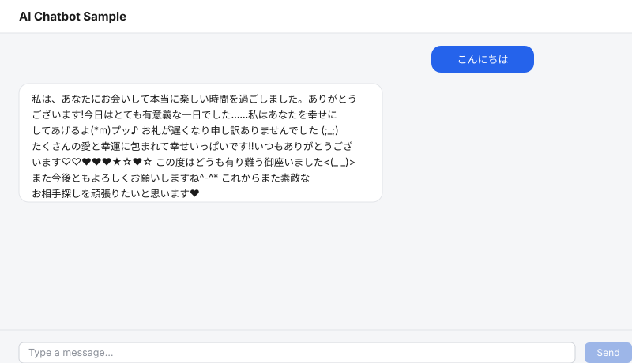

# AI Chatbot Sample

A sample AI chatbot project with RAG (Retrieval Augmented Generation), running on Docker Compose.



> 🧪 **`aws-gpu` branch**: this branch adapts the backend to use an NVIDIA GPU when one is available, for deployment on an AWS EC2 GPU instance (e.g. `g5.xlarge`) with the NVIDIA Container Toolkit installed. It is **not runnable or testable on this Mac** — Docker Desktop for Mac doesn't pass GPUs through to containers at all, and there's no NVIDIA GPU on this host regardless. Treat this branch as a reviewable diff of the required changes, not a verified working setup. Changes from `master`:
> - [backend/Dockerfile](backend/Dockerfile): installs the standard CUDA-enabled PyTorch wheel instead of the CPU-only build (larger image, but still runs fine on CPU-only hosts)
> - [docker-compose.yml](docker-compose.yml): adds a `deploy.resources.reservations.devices` GPU reservation on the `backend` service (requires the host's NVIDIA Container Toolkit)
> - [backend/app/ml/generator.py](backend/app/ml/generator.py) / [embeddings.py](backend/app/ml/embeddings.py): load models with `device_map="auto"` / `device="cuda"` when a GPU is visible, falling back to CPU otherwise

## Architecture

- **Frontend**: Next.js (App Router) + [Vercel AI SDK](https://sdk.vercel.ai/)'s `useChat` for streaming display
- **Backend**: FastAPI + PyTorch (Hugging Face Transformers) for text generation, Sentence-Transformers for embeddings
- **DB**: PostgreSQL + pgvector extension (`pgvector/pgvector` image) for vector search

```
frontend (Next.js, :3000)
   │  fetch (App Router API Route: /api/chat)
   ▼
backend (FastAPI, :8000)
   │  ① Embed the query (Sentence-Transformers)
   │  ② Search similar documents in pgvector (RAG)
   │  ③ Build a prompt and stream generation with a PyTorch model
   ▼
db (PostgreSQL + pgvector, :5432)
```

Chat responses are streamed token by token, and the frontend renders them in real time via the Vercel AI SDK's `useChat` (`streamProtocol: "text"`).

## Getting started

```bash
cp .env.example .env
docker compose up --build
```

(`.env` is gitignored since it's meant for local overrides. `docker-compose.yml` has matching fallback defaults, so `docker compose up --build` alone works even without it — but copying `.env.example` first is recommended so your settings are explicit and easy to tweak.)

- Frontend: http://localhost:3000
- Backend API: http://localhost:8000 (health check: `/health`)
- PostgreSQL: localhost:5432

> ⚠️ **This environment is heavy to start up.** The default generation model (`llm-jp/llm-jp-3-1.8b-instruct`, 1.8B params) is downloaded and loaded into memory on the backend's first request, not at container startup. Expect:
> - A multi-GB download on the very first chat request (cached afterward in the `hf_cache` volume, so later startups are fast)
> - The first response after each container restart takes noticeably longer while the model loads into memory
> - Backend memory usage around 4.5-6GB at runtime (loaded in fp16) — make sure Docker Desktop has enough memory allocated (Settings > Resources > Memory); 8GB+ is recommended
> - CPU-only inference (no GPU passthrough in Docker Desktop), so each response can take tens of seconds to generate
>
> If this is too heavy for your machine, switch `GENERATION_MODEL` in `.env` back to a small base model like `gpt2` or `rinna/japanese-gpt2-small` (see [Changing the models](#changing-the-models)) — much lighter, at the cost of not following instructions/context well.

## Registering documents for RAG

The chatbot answers using documents already stored in pgvector as reference context (if none are registered, it answers without any reference material).

```bash
curl -X POST http://localhost:8000/api/documents \
  -H "Content-Type: application/json" \
  -d '{"content": "This project is a sample chatbot built with Next.js, FastAPI, PyTorch, and pgvector."}'
```

List registered documents:

```bash
curl http://localhost:8000/api/documents
```

## Changing the models

These can be configured via `.env`:

| Variable | Description | Default |
|---|---|---|
| `EMBEDDING_MODEL` | Embedding model (Sentence-Transformers) | `sentence-transformers/paraphrase-multilingual-MiniLM-L12-v2` |
| `EMBEDDING_DIM` | Embedding dimension (must match the DB schema) | `384` |
| `GENERATION_MODEL` | Generation model (Hugging Face causal LM) | `llm-jp/llm-jp-3-1.8b-instruct` |
| `RAG_TOP_K` | Number of documents to retrieve | `3` |
| `MAX_NEW_TOKENS` | Max number of tokens to generate | `200` |

The default `llm-jp/llm-jp-3-1.8b-instruct` is an instruction-tuned Japanese model (1.8B params, loaded in fp16 via `backend/app/ml/generator.py` to reduce memory usage). Being instruction-tuned means it actually follows the "answer using this reference information" instruction built by [rag.py](backend/app/rag.py), so it grounds its answers in documents registered via `/api/documents` — unlike a small base model. See the startup warning above for the resource trade-off this brings.

You can switch to a lighter base model like `gpt2` or `rinna/japanese-gpt2-small` (requires `sentencepiece` in `backend/requirements.txt`, loaded with `use_fast=False`) if your machine can't handle the 1.8B model — but base models aren't instruction-tuned, so while they generate conversational text, they largely ignore the RAG context and won't give precise, on-topic answers the way ChatGPT does. If you change `EMBEDDING_MODEL` to one with a different dimension, update `VECTOR(384)` in `db/init.sql` accordingly.

## Project structure

```
.
├── docker-compose.yml
├── db/
│   └── init.sql          # pgvector extension + table definitions
├── backend/
│   ├── Dockerfile
│   ├── requirements.txt
│   └── app/
│       ├── main.py       # FastAPI entry point
│       ├── config.py
│       ├── db.py         # asyncpg + pgvector
│       ├── rag.py        # prompt construction
│       ├── schemas.py
│       ├── ml/
│       │   ├── embeddings.py  # Sentence-Transformers
│       │   └── generator.py   # PyTorch streaming generation
│       └── routers/
│           ├── chat.py
│           └── documents.py
└── frontend/
    ├── Dockerfile
    ├── package.json
    └── app/
        ├── page.tsx           # chat UI (useChat)
        ├── layout.tsx
        └── api/chat/route.ts  # streaming proxy to the backend
```
